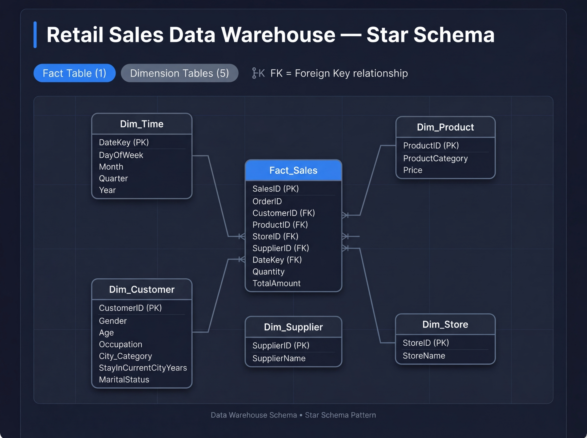

# 🛒 StreamVault DW — Walmart Near-Real-Time Data Warehouse

<div align="center">


**A production-grade, near-real-time streaming data warehouse prototype built on Walmart transactional data — featuring the HYBRIDJOIN stream-relation join algorithm, a Star Schema DWH on MySQL, and a comprehensive OLAP analytics layer.**

[Overview](#-overview) · [Architecture](#-system-architecture) · [Schema](#-star-schema) · [HYBRIDJOIN](#-hybridjoin-algorithm) · [OLAP Queries](#-olap-analytics-layer) · [Lessons Learned](#-lessons-learned)

---

</div>

## 🧭 Overview

Walmart processes **millions of customer transactions daily**. To maintain competitive advantage — through dynamic promotions, personalized recommendations, and rapid market responses — it requires infrastructure that can analyze shopping behavior *as it happens*.

This project implements a fully working prototype of that infrastructure:

| Layer | Technology | Role |
|---|---|---|
| **Data Ingestion** | Multi-threaded Python | Simulates a live transaction stream from CSV sources |
| **Stream Processing** | HYBRIDJOIN Algorithm | Enriches streaming records by joining with disk-resident master data |
| **Storage** | MySQL 8 (Star Schema) | Single source of truth for all analytical queries |
| **Analytics** | 20 OLAP SQL Queries | Slice, dice, roll-up across sales, customers, products, stores |

---

## 🏗️ System Architecture

```
┌─────────────────────────────────────────────────────────────────────┐
│                        SOURCE LAYER                                 │
│                                                                     │
│   transactions.csv ──► [Producer Thread] ──► Stream Buffer Queue   │
│   customers.csv    ──► Loaded into HYBRIDJOIN Disk Relation (R)     │
│   products.csv     ──► Loaded into In-Memory Map (optimization)     │
└─────────────────────────┬───────────────────────────────────────────┘
                          │
                          ▼
┌─────────────────────────────────────────────────────────────────────┐
│                   HYBRIDJOIN PROCESSING LAYER                       │
│                                                                     │
│   Stream Buffer → Hash Table (H) → Probe Queue (FIFO DLIST)        │
│                        │                                            │
│                        ▼                                            │
│   Disk Buffer (500 tuples) ◄── Indexed Read on Relation R           │
│                        │                                            │
│                        ▼                                            │
│   Match Found → Join S ⋈ R → Enriched Tuple Output                 │
└─────────────────────────┬───────────────────────────────────────────┘
                          │
                          ▼
┌─────────────────────────────────────────────────────────────────────┐
│               STAR SCHEMA DATA WAREHOUSE (MySQL)                    │
│                                                                     │
│   dim_customer  dim_product  dim_store  dim_supplier  dim_time      │
│               └──────────────┬──────────────────────┘              │
│                         fact_sales                                  │
│               (SalesID, Quantity, TotalAmount, …FKs)                │
└─────────────────────────┬───────────────────────────────────────────┘
                          │
                          ▼
┌─────────────────────────────────────────────────────────────────────┐
│                    OLAP ANALYTICS LAYER                             │
│                                                                     │
│   20 Business Intelligence Queries (Drill-down · Rollup · Pivot)   │
│   Revenue trends · Product affinity · Seasonality · Outlier detect  │
└─────────────────────────────────────────────────────────────────────┘
```

---

## ⭐ Star Schema

The data warehouse is modeled as a classic **Star Schema** — optimized for read-heavy OLAP workloads. One central fact table is surrounded by five denormalized dimension tables.



### Fact Table — `fact_sales`

The central grain of the schema. Every row represents **one transaction line item**.

| Column | Type | Role |
|---|---|---|
| `SalesID` | INT | 🔑 Primary Key |
| `OrderID` | VARCHAR | FK (product affinity analysis) |
| `CustomerID` | VARCHAR | 🔗 FK → `dim_customer` |
| `ProductID` | VARCHAR | 🔗 FK → `dim_product` |
| `StoreID` | VARCHAR | 🔗 FK → `dim_store` |
| `SupplierID` | VARCHAR | 🔗 FK → `dim_supplier` |
| `DateKey` | DATE | 🔗 FK → `dim_time` |
| `Quantity` | INT | 📊 Measure |
| `TotalAmount` | FLOAT | 📊 Measure |

### Dimension Tables

<details>
<summary><strong>dim_customer</strong> — Customer demographics</summary>

| Column | Type |
|---|---|
| `CustomerID` | VARCHAR (PK) |
| `Gender` | CHAR |
| `Age` | VARCHAR |
| `Occupation` | VARCHAR |
| `City_Category` | VARCHAR |
| `StayInCurrentCityYears` | VARCHAR |
| `MaritalStatus` | INT |

</details>

<details>
<summary><strong>dim_product</strong> — Product catalog</summary>

| Column | Type |
|---|---|
| `ProductID` | VARCHAR (PK) |
| `ProductCategory` | VARCHAR |
| `Price` | FLOAT |

</details>

<details>
<summary><strong>dim_store</strong> — Store information</summary>

| Column | Type |
|---|---|
| `StoreID` | VARCHAR (PK) |
| `StoreName` | VARCHAR |

</details>

<details>
<summary><strong>dim_supplier</strong> — Supplier information</summary>

| Column | Type |
|---|---|
| `SupplierID` | VARCHAR (PK) |
| `SupplierName` | VARCHAR |

</details>

<details>
<summary><strong>dim_time</strong> — Date/time hierarchy</summary>

| Column | Type |
|---|---|
| `DateKey` | DATE (PK) |
| `DayOfWeek` | VARCHAR |
| `Month` | VARCHAR |
| `Quarter` | VARCHAR |
| `Year` | INT |

</details>

---

## ⚙️ HYBRIDJOIN Algorithm

HYBRIDJOIN is a **stream-relation join algorithm** designed to efficiently join a continuous high-velocity data stream **S** with a large, static, disk-resident relation **R**. It is "hybrid" because it combines in-memory hashing (for the stream) with disk-based indexed reads (for the large relation).

### Core Components

```
┌─────────────────────────────────────────────────────┐
│                  HYBRIDJOIN STATE                    │
│                                                     │
│   Stream Buffer  ──► [overflow queue for bursts]    │
│                                                     │
│   Hash Table (H) ──► compartmented by join key      │
│                       capacity = w (free slots)     │
│                                                     │
│   Queue (DLIST)  ──► FIFO order of stream tuples    │
│                       doubly-linked for O(1) delete │
│                                                     │
│   Disk Buffer    ──► 500-tuple chunk from R         │
└─────────────────────────────────────────────────────┘
```

### Step-by-Step Execution Loop

```
LOOP:
  ┌─ Step 1: Load Stream ──────────────────────────────┐
  │  Pull up to w tuples from Stream Buffer into H     │
  │  Append their keys to the tail of the Queue        │
  └────────────────────────────────────────────────────┘
               │
               ▼
  ┌─ Step 2: Get Probe Key ────────────────────────────┐
  │  Peek at the oldest key at the HEAD of the Queue   │
  └────────────────────────────────────────────────────┘
               │
               ▼
  ┌─ Step 3: Load Relation ────────────────────────────┐
  │  Indexed read from disk → 500 tuples into          │
  │  Disk Buffer at position matching probe key        │
  └────────────────────────────────────────────────────┘
               │
               ▼
  ┌─ Step 4: Probe ────────────────────────────────────┐
  │  Iterate Disk Buffer; for each tuple probe H       │
  └────────────────────────────────────────────────────┘
               │
               ▼
  ┌─ Step 5: Join, Load, Delete ───────────────────────┐
  │  On match → JOIN(s_tuple, r_tuple)                 │
  │           → INSERT into fact_sales                 │
  │           → DELETE from H and Queue                │
  └────────────────────────────────────────────────────┘
               │
               ▼
  ┌─ Step 6: Update Slots ─────────────────────────────┐
  │  Increment w for every evicted stream tuple        │
  └────────────────────────────────────────────────────┘
               │
               └──► LOOP BACK TO STEP 1
```

### Known Limitations

| # | Shortcoming | Impact |
|---|---|---|
| 1 | **Single R relation only** | Cannot natively join S with multiple large master tables; workaround: load smaller relations into memory |
| 2 | **Head-of-line blocking** | If the oldest key has no match in R, a full disk I/O cycle is wasted |
| 3 | **No spill-to-disk for stream** | Under sustained overload, the stream buffer overflows and tuples are permanently lost |

---

## 📊 OLAP Analytics Layer

All 20 queries operate on the Star Schema and demonstrate a range of analytical patterns:

| # | Query | Technique |
|---|---|---|
| Q1 | Top revenue products — weekday vs weekend with monthly drill-down | **Conditional aggregation + time hierarchy** |
| Q2 | Purchase amounts by gender, age, city category | **Multi-dimensional grouping** |
| Q3 | Product category sales by customer occupation | **Cross-dimension join** |
| Q4 | Purchases by gender × age × quarter | **Time-series grouping** |
| Q5 | Top 5 occupations per product category | **RANK() window function** |
| Q6 | City category performance by marital status — last 6 months | **Rolling window filter** |
| Q7 | Average purchase by city stay duration × gender | **Behavioural segmentation** |
| Q8 | Top 5 revenue cities by product category | **DENSE_RANK() partition** |
| Q9 | Month-over-month sales growth % by product category | **LAG() window function** |
| Q10 | Weekend vs weekday sales by age group | **Pivot-style conditional sums** |
| Q11 | Top 5 products revenue — weekday/weekend monthly drill-down | **Combined time + product analysis** |
| Q12 | Store quarterly revenue growth rate for 2017 | **QoQ growth with LAG()** |
| Q13 | Supplier sales contribution by store × product | **Three-level grouping hierarchy** |
| Q14 | Product sales by season (Spring/Summer/Fall/Winter) | **Dynamic seasonal drill-down** |
| Q15 | Month-to-month revenue volatility per store/supplier pair | **Volatility = % change via LAG()** |
| Q16 | Top 5 product affinity pairs across orders | **Self-join product affinity** |
| Q17 | Yearly revenue by store × supplier × product with ROLLUP | **ROLLUP hierarchical aggregation** |
| Q18 | Revenue and volume H1 vs H2 comparison per product | **Semi-annual period pivoting** |
| Q19 | Daily sales outlier detection (>2× daily average) | **Statistical anomaly flagging** |
| Q20 | `STORE_QUARTERLY_SALES` view for optimized store analysis | **Materialized view creation** |

---

## 🧠 Lessons Learned

Four critical insights emerged from building this system — each one earned the hard way:

### 1. Data Cleaning is the Hardest Part
> "The pipeline fails on dirty data, not flawed logic."

Hidden whitespace in CSV headers (`' CustomerID'` vs `'CustomerID'`), inconsistent column naming (`Stay_In_Current_City_Years` vs `StayInCurrentCityYears`), and MySQL case-sensitivity (`Dim_Customer` vs `dim_customer`) each caused full pipeline failures. A defensive ETL layer that aggressively strips, normalizes, and validates data is not optional — it is the foundation.

### 2. Indexes are Not Optional — They are the Product
Before indexing on foreign keys in `fact_sales`, analytical queries took **10–15 seconds** due to full-table scans across millions of rows. After `CREATE INDEX` on all FK columns, the same queries ran in **under 2 seconds**. Schema design is only half the story; indexing strategy determines whether the warehouse is usable.

### 3. Theory vs Practical Adaptation
The HYBRIDJOIN algorithm is designed for one stream (S) and one disk relation (R). This project requires joining against both customer and product master data. The gap between theory and reality was bridged by loading the smaller product table into an in-memory dictionary — a pragmatic compromise that highlights the need to adapt theoretical models to real-world constraints.

### 4. Transaction Management in Multi-Threaded ETL
In a multi-threaded pipeline with a shared MySQL connection, `SET FOREIGN_KEY_CHECKS=0` implicitly opens a transaction. Without an explicit `conn.commit()`, every subsequent operation in the thread fails with a silent "Transaction already initialized" error. Proper connection lifecycle management — especially `commit()` and `rollback()` discipline — is non-negotiable in concurrent database workloads.

---

## 🚀 Getting Started

### Prerequisites

```bash
# Python 3.10+
pip install mysql-connector-python pandas

# MySQL 8.0 running locally
mysql -u root -p
```

### Database Setup

```sql
CREATE DATABASE walmart_dwh;
USE walmart_dwh;
-- Run schema.sql to create all tables
SOURCE schema.sql;
-- Run indexes for performance
SOURCE indexes.sql;
```

### Run the Pipeline

```bash
# 1. Start the near-real-time ETL pipeline
python pipeline.py

# 2. Verify data loaded into the warehouse
python verify.py

# 3. Run all 20 OLAP queries
python run_olap_queries.py
```

---

## 📁 Project Structure

```
streamvault-dw/
│
├── README.md                  # This file
├── star.png                   # Star schema diagram
│
├── data/
│   ├── transactions.csv       # Source transaction stream
│   ├── customers.csv          # Customer master data (R relation)
│   └── products.csv           # Product master data (in-memory map)
│
├── sql/
│   ├── schema.sql             # DDL: CREATE TABLE statements
│   ├── indexes.sql            # Performance indexes on fact_sales FKs
│   └── olap_queries.sql       # All 20 OLAP analytical queries
│
├── src/
│   ├── pipeline.py            # Main ETL orchestrator (multi-threaded)
│   ├── hybridjoin.py          # HYBRIDJOIN algorithm implementation
│   ├── producer.py            # Stream producer thread
│   └── loader.py              # DWH loader (fact + dimension insert)
│
└── docs/
    └── project_report.pdf     # Full academic report
```

---

## 🎓 Academic Context

| Field | Detail |
|---|---|
| **Institution** | Bachelor of Science in Data Science |
| **Course** | DS3003 / DS3004 — Data Warehousing & Business Intelligence |
| **Semester** | Fall 2025 |
| **Student** | Zain Shahid — DS-5A — 23i2582 |
| **Weight** | 15% of final grade |

---

<div align="center">

*Built with precision. Engineered for insight.*

</div>
